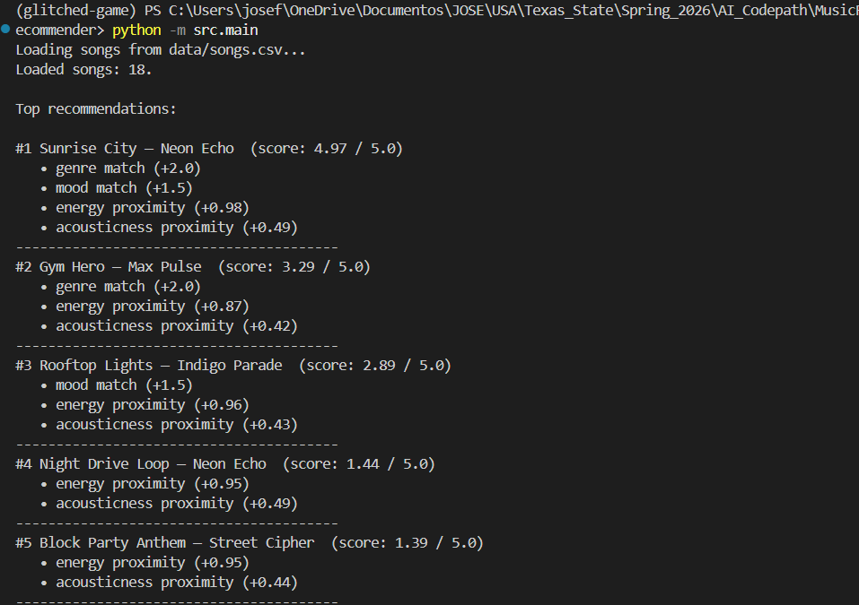
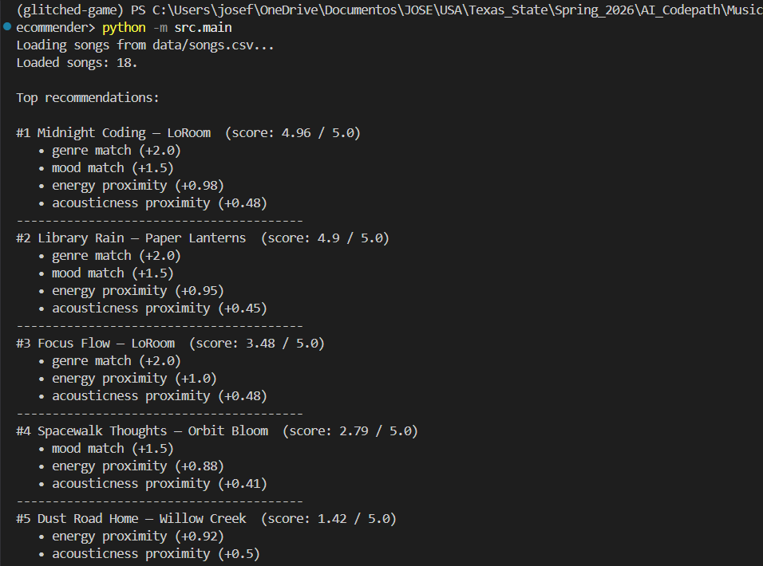
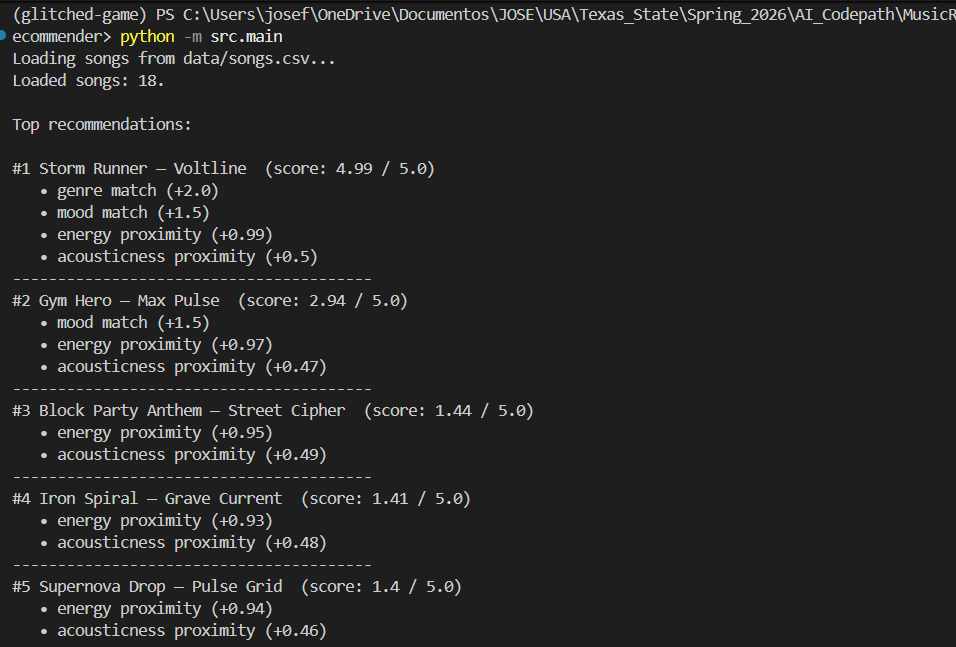
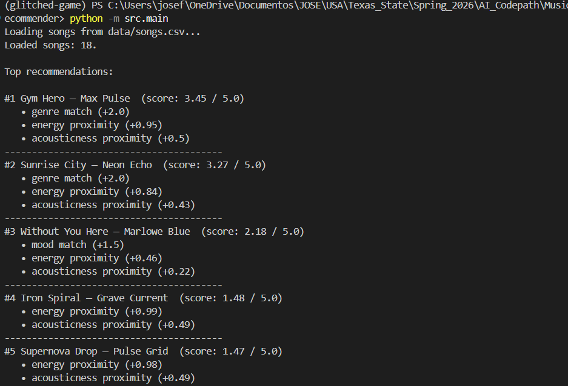
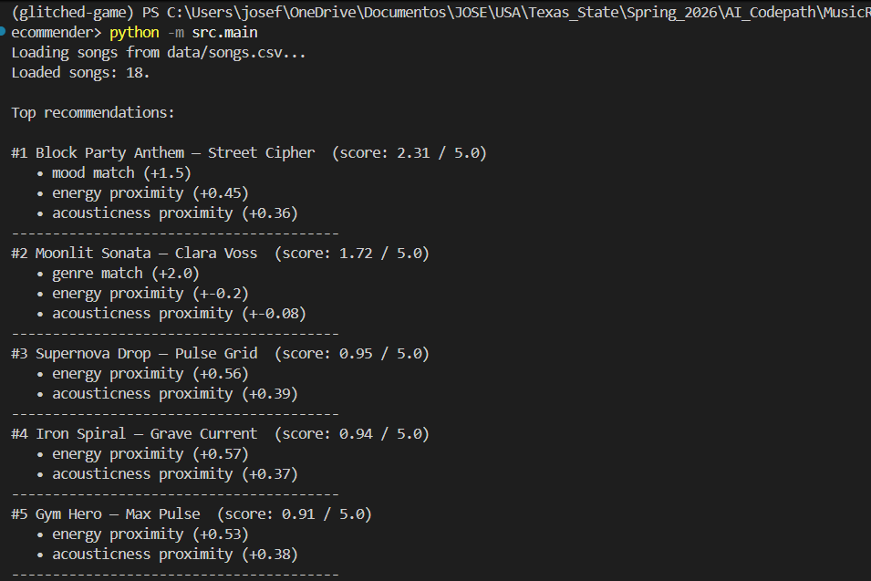

# 🎵 Music Recommender Simulation

## Project Summary

Waripolo Vicencio 2.2 is a content-based music recommender that scores every song 
in an 18-song catalog against a user's taste profile and returns the top 5 
matches. It uses four features — genre, mood, energy, and acousticness — 
with a weighted scoring formula that maxes out at 5.0 points per song. 
Built as a classroom project to explore how real recommenders turn data 
into predictions, and where bias shows up even in simple systems.

---

## How The System Works

Unlike collaborative filtering — which recommends songs based on what 
similar users liked — this system is **content-based**: it looks only at 
the attributes of the songs themselves and matches them against what the 
user explicitly prefers.

The system prioritizes **genre** and **mood** as the strongest signals of 
taste (weighted at 2.0 and 1.5 respectively), then fine-tunes the score 
using how close a song's energy and acousticness are to the user's targets. 
It is worth noting that heavily weighting genre introduces a bias: a 
wrong-genre song can almost never outscore a right-genre one, even if it 
matches everything else perfectly.

Keeping `target_acousticness` as a float rather than a simple yes/no 
boolean makes the scoring more nuanced — it lets the system tell the 
difference between a slightly acoustic indie track and a fully unplugged 
folk recording, which a boolean would treat identically.

Every song in the catalog is scored, sorted by score descending, and the 
top K results (default `K = 5`) are returned.

### Song Features

Each `Song` uses four primary features:

| Feature | Type | Description |
|---|---|---|
| `genre` | categorical | Musical genre (e.g. lofi, pop, jazz) |
| `mood` | categorical | Emotional feel (e.g. chill, happy, intense) |
| `energy` | float 0–1 | How active or intense the song sounds |
| `acousticness` | float 0–1 | How acoustic vs. electronic the song is |

Optional bonus features (`valence`, `danceability`, `tempo_bpm`) are 
available in the dataset but not used in the primary scoring formula.

### UserProfile

A `UserProfile` stores the user's preferences across the same four 
dimensions:

| Field | Type | Example |
|---|---|---|
| `favorite_genre` | string | `"lofi"` |
| `favorite_mood` | string | `"chill"` |
| `target_energy` | float 0–1 | `0.40` |
| `target_acousticness` | float 0–1 | `0.75` |

### Scoring Rule (one song at a time)

Each song receives a score out of a maximum of **5.0**:

```
+2.0  if song.genre == user.favorite_genre
+1.5  if song.mood == user.favorite_mood
+1.0 × (1 - |song.energy - user.target_energy|)
+0.5 × (1 - |song.acousticness - user.target_acousticness|)
```

Genre and mood are weighted highest because they are the strongest signals 
of user taste. Energy and acousticness use distance-based scoring — the 
closer the song is to the user's target, the higher the contribution.

### Ranking Rule (whole catalog)

1. Apply the scoring rule to every song in the catalog
2. Sort all songs by score in descending order
3. Return the top `k` songs (default: `k = 5`)

### Output Screenshots


| Profile | Screenshot |
|---|---|
| Pop / Happy |  |
| Chill Lofi |  |
| Intense Rock |  |
| Adversarial: Conflicting Prefs |  |
| Adversarial: Out-of-range Values |  |

---

## Getting Started

### Setup

1. Create a virtual environment (optional but recommended):

```bash
   python -m venv .venv
   source .venv/bin/activate      # Mac or Linux
   .venv\Scripts\activate         # Windows
```

2. Install dependencies

```bash
pip install -r requirements.txt
```

3. Run the app:

```bash
python -m src.main
```

### Running Tests

Run the starter tests with:

```bash
pytest
```

You can add more tests in `tests/test_recommender.py`.

---

## Experiments You Tried

**Weight shift — doubled energy, halved genre:**
Changed genre match from +2.0 to +1.0 and energy multiplier from 1.0 to 
2.0. The rock user immediately started getting EDM and hip-hop in their 
top 5 because those songs share high energy values. The system became more 
vibe-aware but less genre-loyal. Reverted after the experiment.

**Adversarial profiles:**
Tested a pop/sad/high-energy profile — genre weight dominated and the sad 
mood only appeared at #3 in a soul song. Tested an out-of-range profile 
(energy: 1.4, acousticness: -0.2) which exposed a bug where proximity 
scores went negative. Fixed by clamping all input values to 0.0–1.0.

---

## Limitations and Risks

- Most genres have only one song in the catalog, so users outside pop and 
  lofi get poor variety after the #1 result
- Genre weight (2.0) is 40% of the max score — it dominates even when the 
  user's other preferences point elsewhere
- Energy proximity is used as a tiebreaker but can act as a false proxy, 
  pushing EDM into a rock user's results just because both are high energy
- The system has no memory — it treats every query identically with no 
  learning from past results

---

## Reflection

Read and complete `model_card.md`:

[**Model Card**](model_card.md)

Building this system made it clear that recommendation is not really about 
math — it is about what you decide the math should measure. Every weight 
is a design choice that encodes an assumption about what users care about. 
When I doubled the energy weight in my experiment, the rock user started 
getting EDM recommendations. The numbers were still correct. The results 
were just wrong.

Bias shows up before you write a single line of code. The catalog only 
has one rock song, one metal song, one folk song. That imbalance means 
those users get one good result and four fallbacks, no matter how good 
the algorithm is. Real platforms solve this partly through scale — with 
millions of songs, catalog imbalance matters less. At 18 songs, every 
gap is visible.